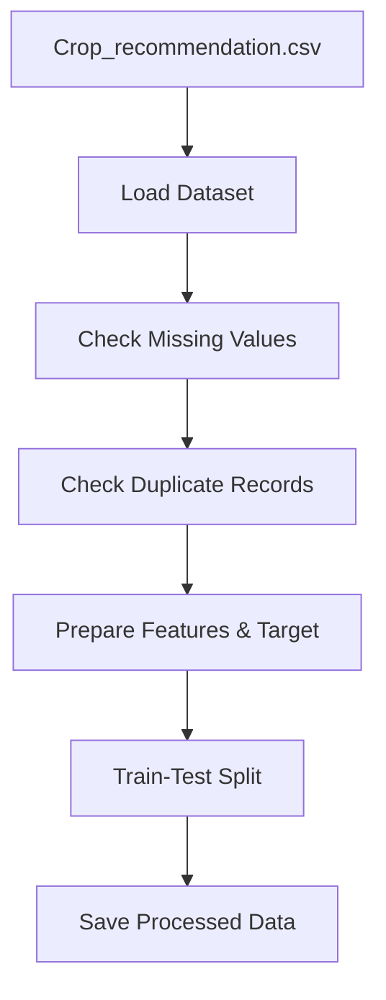

# OptiCrop - Data Preprocessing (Epic 3)

## Project Objective

The objective of this module is to prepare the **Crop_recommendation.csv** dataset for machine learning. The preprocessing phase includes loading the dataset, checking data quality, handling missing values and duplicate records, preparing input features and target labels, and splitting the dataset into training and testing sets for model development.

---

## Preprocessing Workflow



---

## Tasks Performed

1. Imported the required libraries such as **Pandas**, **NumPy**, and **Scikit-learn**.
2. Loaded the **Crop_recommendation.csv** dataset.
3. Displayed dataset information including shape, columns, and data types.
4. Checked the dataset for missing values.
5. Verified that there were no duplicate records.
6. Selected the following input features:
   - Nitrogen (N)
   - Phosphorus (P)
   - Potassium (K)
   - Temperature
   - Humidity
   - pH
   - Rainfall
7. Selected the target variable (**label**) containing crop names.
8. Split the dataset into **80% training data** and **20% testing data** using `train_test_split`.

---

## Folder Structure

```text
04_Preprocessing/
│
├── README.md
├── preprocessing.py
│
├── outputs/
│   ├── train.csv
│   ├── test.csv
│   └── preprocessing_report.txt
```

---

## Outputs Generated

- **train.csv** – Training dataset.
- **test.csv** – Testing dataset.
- **preprocessing_report.txt** – Summary of preprocessing steps.

---

## How to Run

```bash
# Run from project root
python 04_Preprocessing/preprocessing.py

# Or run from inside the directory
cd 04_Preprocessing
python preprocessing.py
```

---

## Expected Results

After running the preprocessing script:

- Dataset is loaded successfully.
- Missing values and duplicate records are checked.
- Features and target variables are prepared.
- Dataset is divided into training and testing sets.
- Processed files are saved in the **outputs** folder.